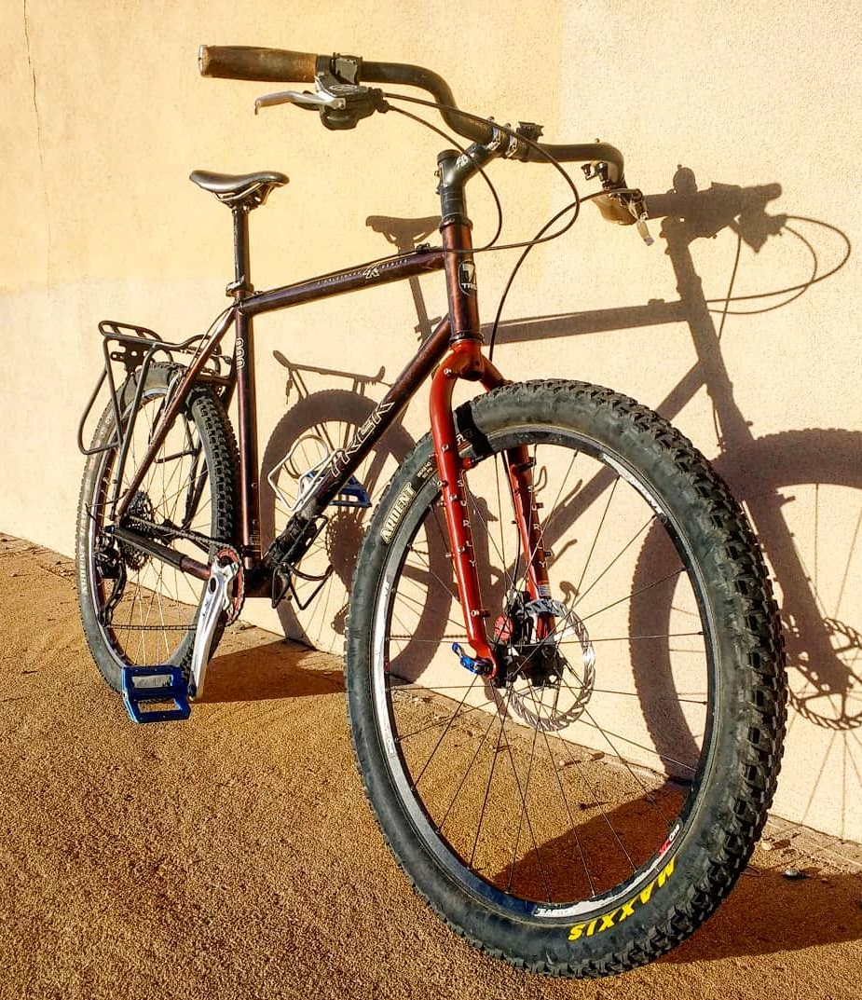

The Trek 990&mdash;or, as we affectionately refer to it, "The Goofy Bike"&mdash;is the bike that made me realize how much fun it can be to ride a rigid mountain bike.

The frame is from 1995, and at the time it was one of Trek's top-of-the-line steel mountain bikes. It is rather surprising how light this bike is for a steel frame.

It originally would have shipped with a rigid steel fork that matches the frame color, but the guy I bought it from in Santa Fe had replaced it with an Origin 8 rigid carbon fiber fork.

Here is how the bike was set up the day that I bought it in 2017:

The guy that I bought the bike from made the frame bag, as well as the purple seat bag and top tube bag shown in this picture:

He still makes bike bags through his company Tribulus Limited: [you can find them here](https://www.tribuluslimited.com). Tell him WIll sent you!

I'd had an interest in bikepacking for a while but had always felt like the upfront cost was prohibitive. I didn't have a mountain bike without rear-suspension, which made adding a frame bag borderline impossible at the time. I also didn't have a good sense of how to go about loading a bike properly for camping excursions.

Buying the 990 felt like opening the door into the bikepacking world. It was the first mountain bike I'd owned that was capable of carrying everything I needed for a camping trip, and it did so comfortably. Here it is packed up for a night out on the [Caja del Rio Mesa](https://en.wikipedia.org/wiki/Caja_del_Rio) near Santa Fe.

Eventually, a small chip developed on the carbon fiber fork that was on the bike when I bought it. I'm not sure if the chip occurred in a crash on the bike (we all crash sometimes) or if the fork got damaged in transportation by rubbing against other bikes.

Regardless, I wasn't comfortable continuing to ride on a damaged fork, especially since my partner had by this point appropriated the bike for herself. Carbon fiber has this nasty tendency to explode when it fails which, when you're talking about a bike fork, can quickly lead to the loss of teeth or the breaking of bones.

After researching our options, we decided to replace the carbon fiber fork with a steel [Surly Troll fork](https://surlybikes.com/parts/troll_fork)&mdash;complete with all the nubbins one could want for attaching stuff to the fork.

My partner isn't crazy about the fork's color, but I think it suits the bike quite well.

The new fork made it easier for me to try a basket-packing style set up with this bike as well:

While this configuration of the bike looks great, it handled like hot garbage when there was any significant weight in the basket. The front-end geometry was not designed for carrying a front load. Would not recommend trying this at home.

---

This bike is not fancy, it is not flashy, it is not new, and it was not expensive. It is also one of my favorite bikes. There is something indescribable about the ride quality of these old steel mountain bikes, that you really can't understand until you ride one.

If you have the means and you see a 990 for sale I urge you to consider buying it and tweaking it to your liking. You won't be disappointed.
