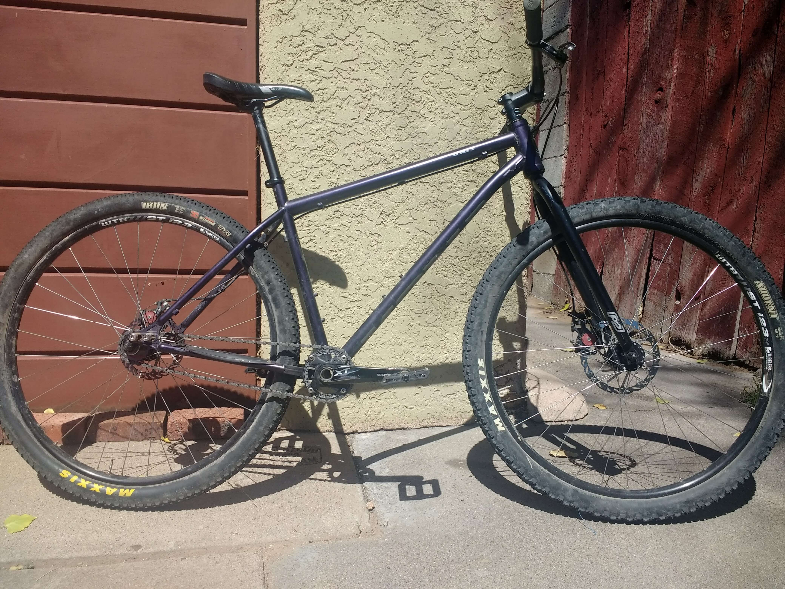
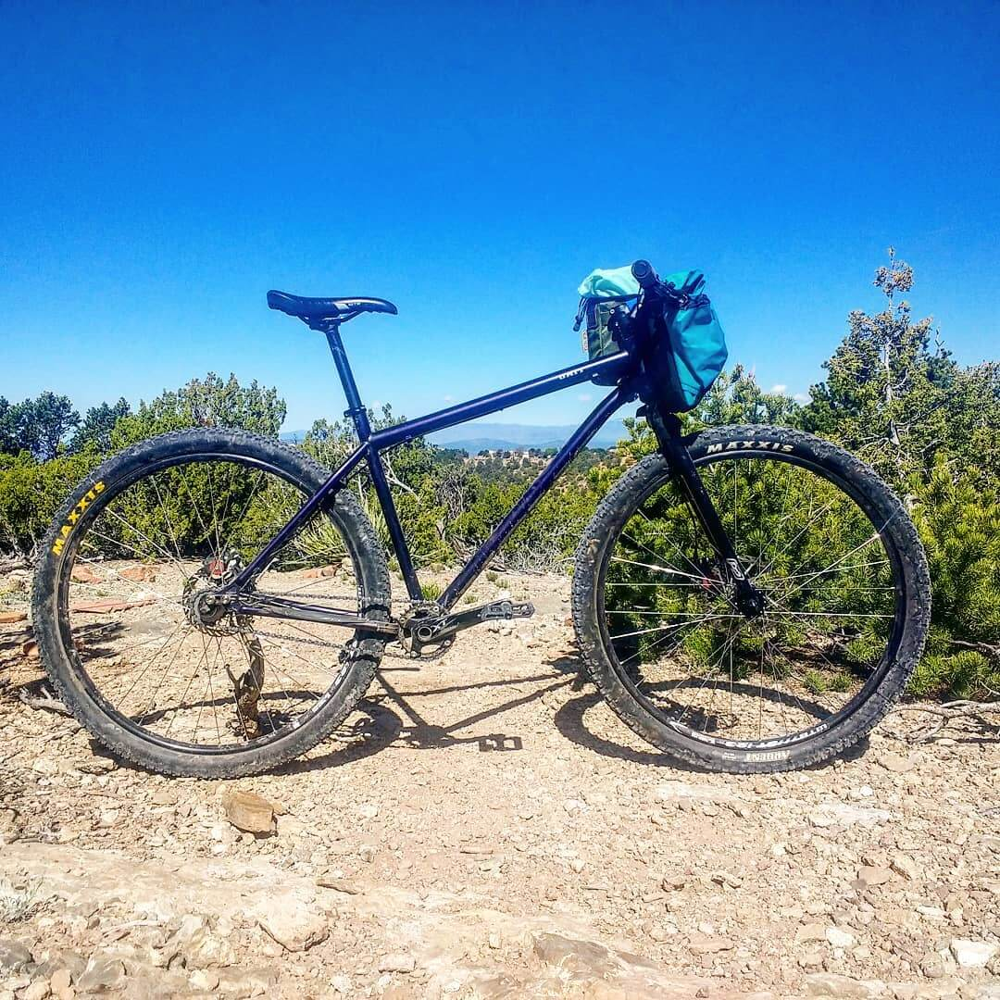
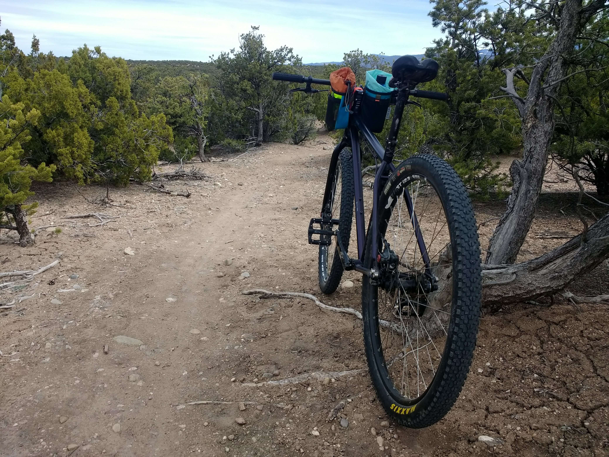
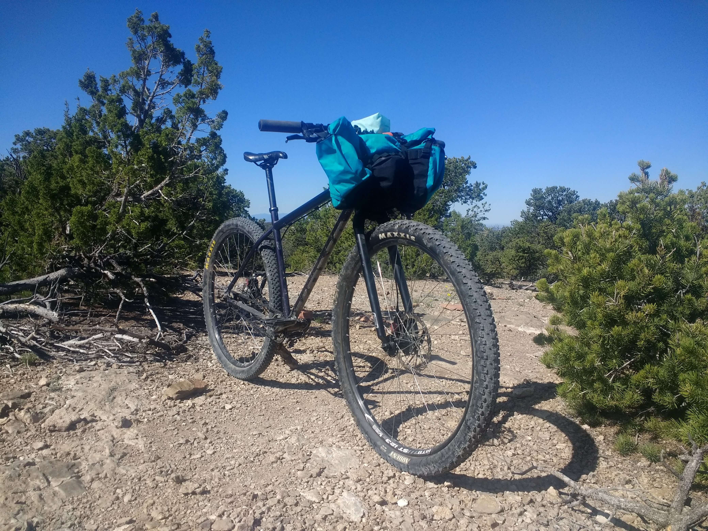

I bought my 2015 Kona Unit at the end of 2017 from a guy I found on [Pinkbike](https://www.pinkbike.com/) in New Mexico. I thought I might be interested in single-speed mountain biking and was able to pick this up for a good price, so I went for it.

It's fully rigid, rocks 29" wheels, has sliding rear dropouts, and climbs like a goat.

The 2015 Unit runs 29 x 2.25" tires and doesn't have room for much larger in the rear. Recent models have shipped with clearance up to 29 x 3", which sounds dreamy to me.

I haven't pulled the trigger on replacing my frame yet though, mostly because I _really like_ the metallic purple color that I currently have. 2.25" is plenty for now, especially with the kind of mountain biking I've been doing recently (mostly long rides on fire roads). I am considering trying out a 2.4-2.6" tire up front for a bit more float and traction.

I think running tubeless on this bike, or really any rigid mountain bike, is almost mandatory. Maintaining traction is incredibly important when climbing up challenging sections of trail on a single-speed, and running very low PSI helps a ton. I tend to have these tires right around 16-20 PSI for most rides.

One feature of the Unit that I didn't fully appreciate at first is the sliding rear dropouts. Bike chains stretch gradually as they are used, and when you're riding a bike with only one gear and no spring-loaded derailleur mechanism, all of that stretch results in an increasingly slack chain. The Unit solves this problem with a mechanism that holds the rear axle which allows the rear wheel to slide back relative to the frame, tensioning the chain. It's an elegant solution to the problem, and a nice feature of the frame.

I have the bike set up with a 30t chain-ring in the front and an 18t cog in the rear. This set up is a nice compromise that allows me to get some decent pedaling done on flat ground, but I've definitely taken the bike on rides where I would have appreciated lower gearing for the climbs. Especially since moving to California: some of these fire roads are relentless.

I haven't taken this bike out for much bike-packing yet, but I'm sure it would do well. I tend to keep my [Tribulus Limited Endover](https://www.tribuluslimited.com/shop-1/endoverpreorder) on the bike for carrying tools, clothing, water, and food.

Even with a bunch of stuff in the bag, I don't find that it affects the handling of the Unit too much. It seems to take to a front load fairly well.

Another major benefit to the single-speed is the reduced maintenance. I basically only need to air up the tires, oil the chain, and slide the dropouts back as the chain stretches. The drivetrain is also _super quiet_ compared with my other bikes, since the chain line is always straight.

Single-speed mountain biking is an interesting endeavor that I've learned to love. Without the help of multiple gears, I have to read the trail well, focus on technique, and sometimes just drop the hammer to power through more challenging uphill sections. The bike is a great teacher, and I think it has made me a better, stronger mountain biker.
