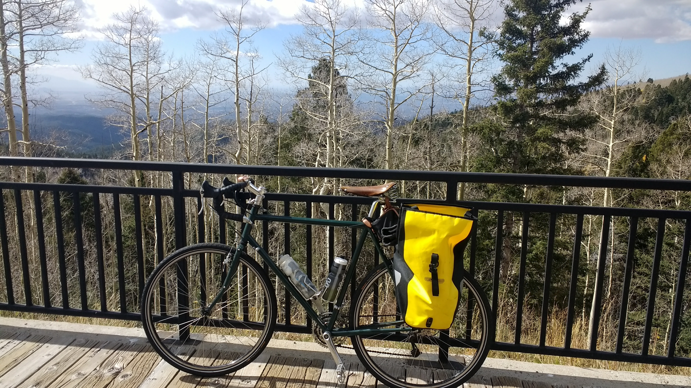
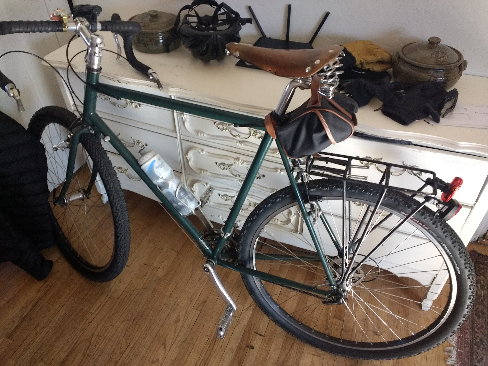
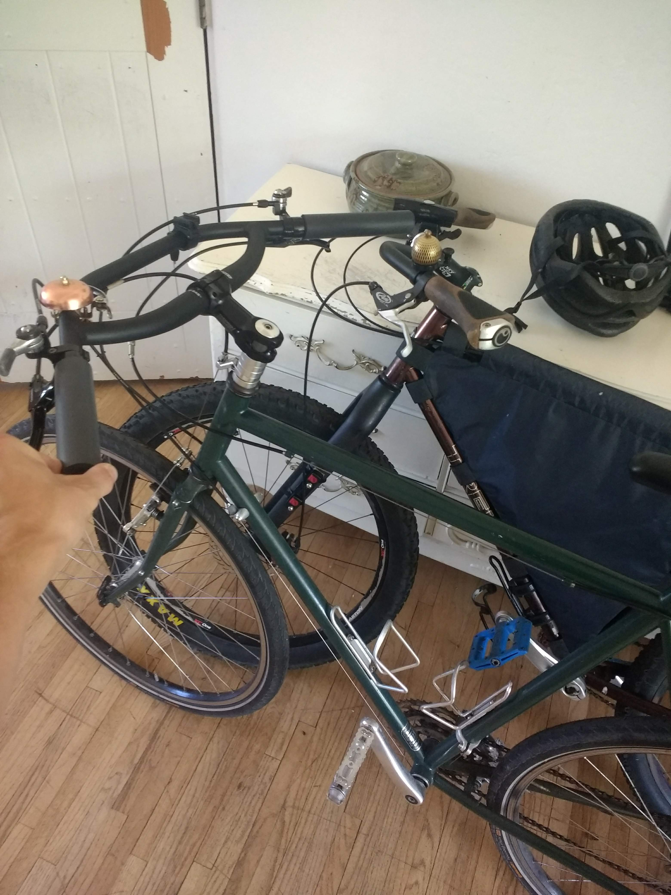
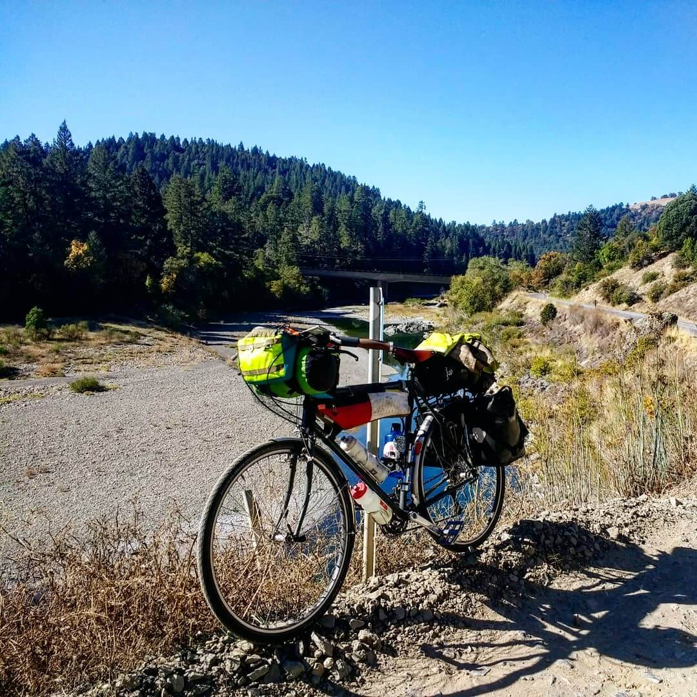

The Surly Long Haul Trucker is the bike that reminded me how much I love to ride bikes.

I found mine used on Craigslist in Albuquerque, New Mexico while we were living in Santa Fe in 2013.

Up to that point, I had been riding a mid-80's Trek road bike which, while fast, was anything but comfortable.

The LHT is a completely different beast.

Unfortunately I've lost the oldest picture of my LHT from the day that I bought it, but this is essentially how it was set up back then.

I've gone through many iterations with this bike.

Here I tried setting up with the fattest tires I could fit in the frame. It was fun to ride for a couple days, but the tire clearance was not great&mdash;if I was standing and really putting power into the frame there definitely was some tire rub. I believe these tires were 700c x 50mm.

The LHT showed me that it was possible to do most things without relying on a car.

I've used it for commuting for years, and hooked it up with a bike trailer to go car-free for a stretch while living in New Mexico.

It also introduced me to the joys of bike camping and long distance touring.

In October of 2018, I rode the LHT 1700+ miles over 5 weeks from Vancouver, British Columbia to Los Angeles, California on the [Pacific Coast Route](https://www.adventurecycling.org/routes-and-maps/adventure-cycling-route-network/pacific-coast/). Here she is all packed up with everything that I needed for that trip.

I decided to swap out the drop bars for some super-wide [Jones Loop H-Bars](https://www.jonesbikes.com/jones-h-bar-butted-loop-aluminum/), which made the bike even more comfortable.

You lose a bit of efficiency by not being able to tuck down in the drops when riding at high speeds or into a headwind, but the gain in comfort is worth it.

This picture gives you a good sense of how large the H-Bar is. I got the widest bar they make: 710mm.

The H-Bar affords a large number of different hand positions, allowing you to move your hands around and stay comfortable during long days in the saddle. You can approximate being 'on the hoods' by putting your hands at the junction of the cross bar&mdash;you can even get a bit of an aero-tuck by resting your forearms across the crossbar and loop. My only complaint with these positions is that you don't have immediate access to shifting and braking controls.

Here's an image showing how I had the bars set up for touring. There is just _so much space_. Even with all of this gear on the bars, I still felt like I had a ton of room to move around.

The LHT was made to carry weight _comfortably_. It isn't the fastest or most responsive bike, but throw 40+ lbs of stuff on it and, surprisingly, the bike rides better than it does unloaded. It was an _absolute pleasure_ to ride on tour, and quite possibly the best bike purchase I've ever made.

