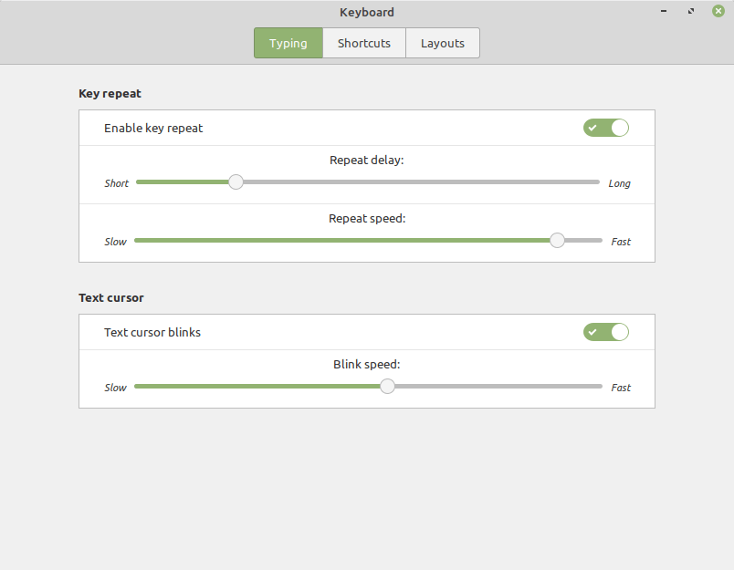
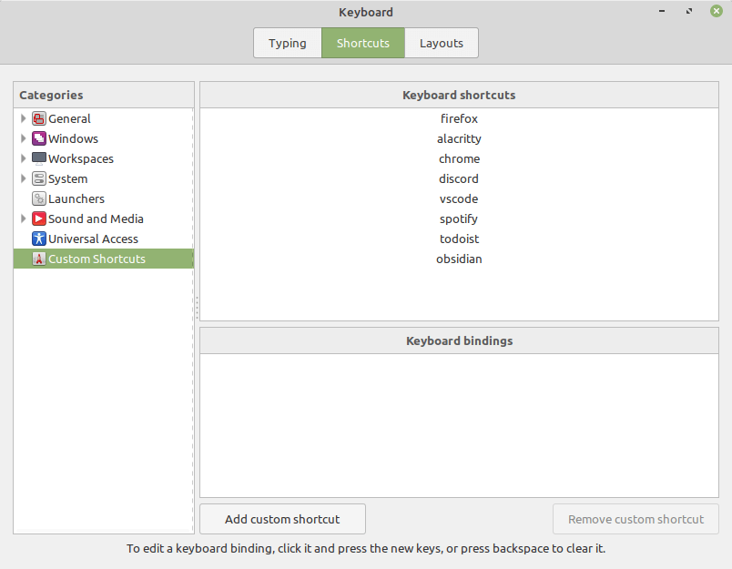
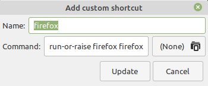
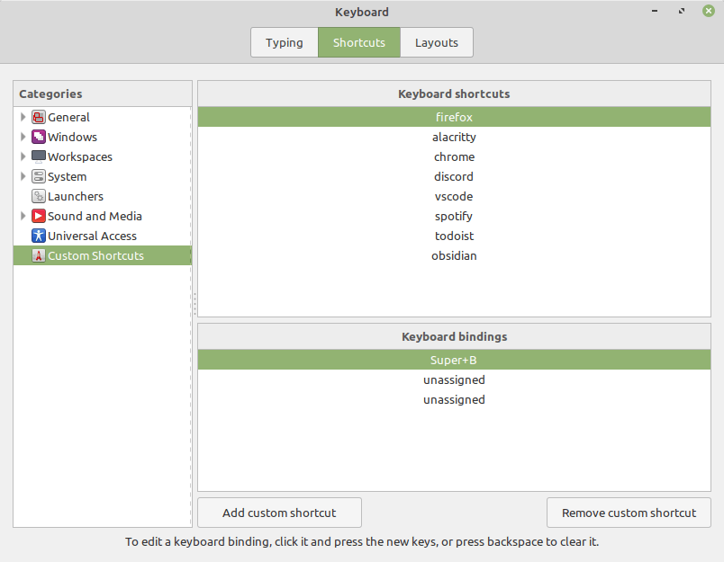

As a means of navigating between applications on your computer, `Alt+Tab` sucks.

When I'm working on a coding project, I often will have six or more different applications running simultaneously. At any given point in time, there is no reliable way to know where in the `Alt+Tab` stack the program that I want to use is.

For an operation as fundamental as switching between applications, which I probably perform hundreds of times a day, why should I need to scan through a list of items, find the thing that I want, and then _tab tab tab tab tab_? There must be a better way.

One solution that I found is called `run-or-raise`, and the thinking is that each frequently used application should be one key combination away at all times. Calling `run-or-raise` on an application should either:

1. **run** the application if it is not already running and focus on it, or
2. **raise** the application, switch to the workspace where it is currently running and focus on it.

It's pretty easy to get a basic scripted implementation of `run-or-raise` working in almost any Unix window manager so long is it is compatible with the [EWMH specification](http://standards.freedesktop.org/wm-spec/wm-spec-1.3.html) (most window managers are compatible).

## Setting Up the Script

First, confirm that [`wmctrl`](http://tripie.sweb.cz/utils/wmctrl/) is installed&mdash;it should be in the default repositories for most Linux distributions.

Next we write our basic `run-and-raise` shell script:

```shell
wmctrl -x -a "$1" || $2
```

> `-x` includes class names in the window list for wmctrl
> `-a` activates the application if it is already running (raising it)

What's going on here? The first command takes the string argument given by `$1` and checks if it matches one of our running applications'**class names**. If it matches, it raises the application. If it doesn't match, the second half of the command after the `||` is run, executing the command given by `$2`.

Note that if we have multiple windows for the same application open, this will only switch to one of the windows. It doesn't allow for cycling through them. (There are [other](https://github.com/CZ-NIC/run-or-raise) [solutions](https://github.com/Soft/run-or-raise) that do, but I have yet to experiment with them.)

In most cases the `$1` and `$2` arguments will be the same. If that doesn't work, some detective work is required to find out what class name to pass in on `$1`. If you run the program and check the output of `wmctrl -l -x`, the third column will give the application's class name prefixed by `.`.

> The `-l` flag for `wmctrl` lists the windows currently managed by the window manager.

## Using the Script

We want to save the script we wrote above to `/usr/local/bin/run-or-raise`, then make the script executable:

```shell
sudo chmod a+x /usr/local/bin/run-or-raise
```

Now that this script is executable on our system, we can bind shortcuts to specific applications for `run-or-raise`.

I use Linux Mint on my computers, so I'm able to go to the keyboard settings menu:



Then in the shortcuts tab, click on "Custom Shortcuts":



Each of these shortcuts correspond to an application that I have set up with `run-or-raise`. Using `firefox` as an example, my shortcut looks like this:



So the command is `run-or-raise firefox firefox`&mdash;`firefox` is being passed in as the value for both `$1` and `$2` here. I then bind this command to a keyboard shortcut that works for me:



I used `Super+B`, but you can make it whatever shortcut works best for your current setup.

Note that even though the `WM_CLASS` from `wmctrl` for Firefox is `Navigator.Firefox`, I can pass a case-insensitive substring of that class name to the script with no issue.

This is ultimately a very simple little script, but in the few days that I've used it I've found that it greatly improves my efficiency when switching between applications.
