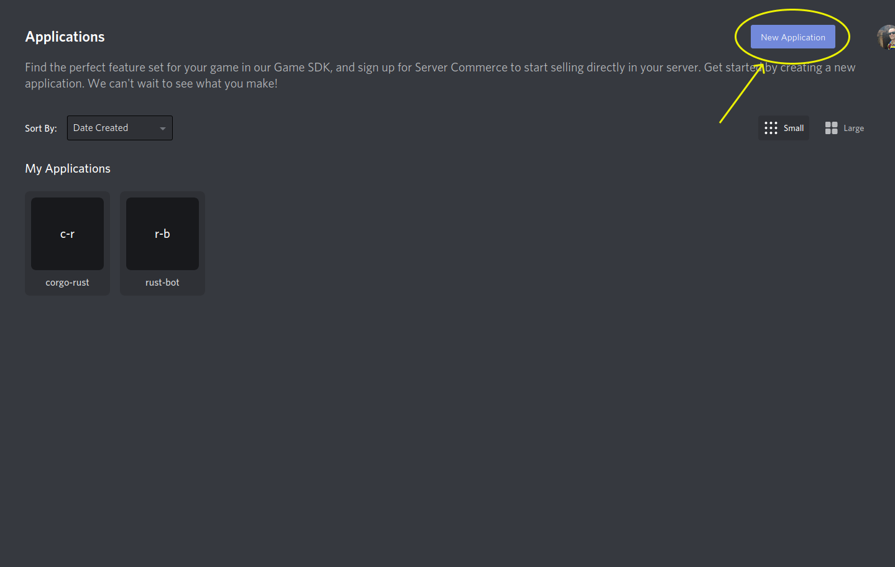
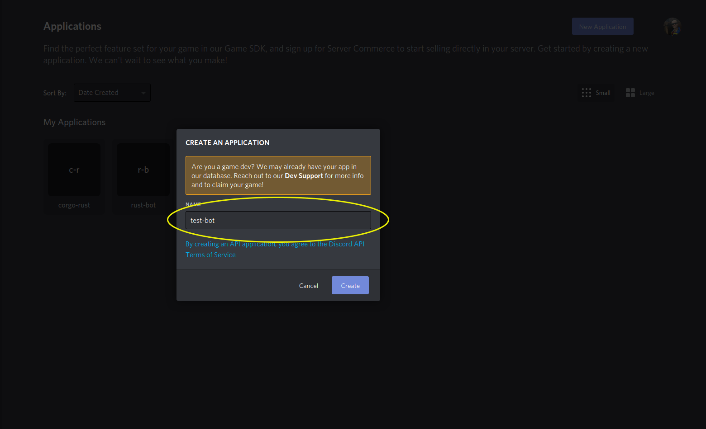
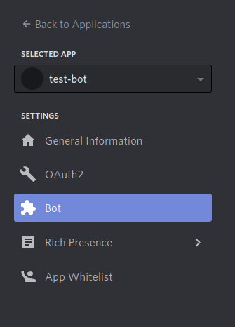
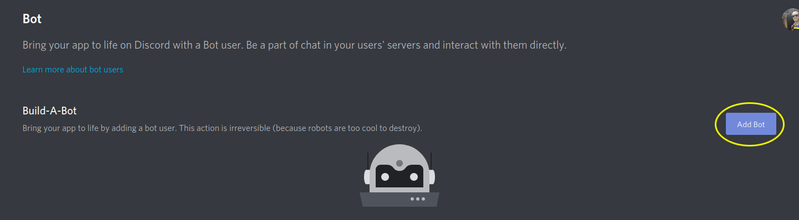
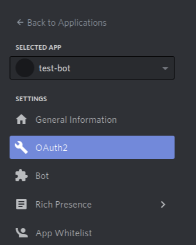
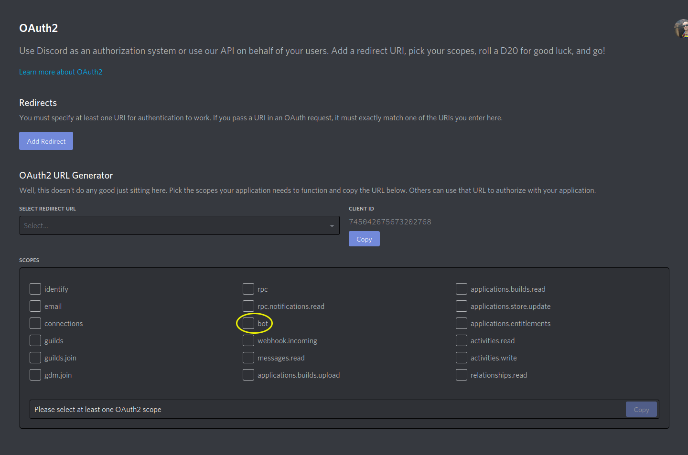
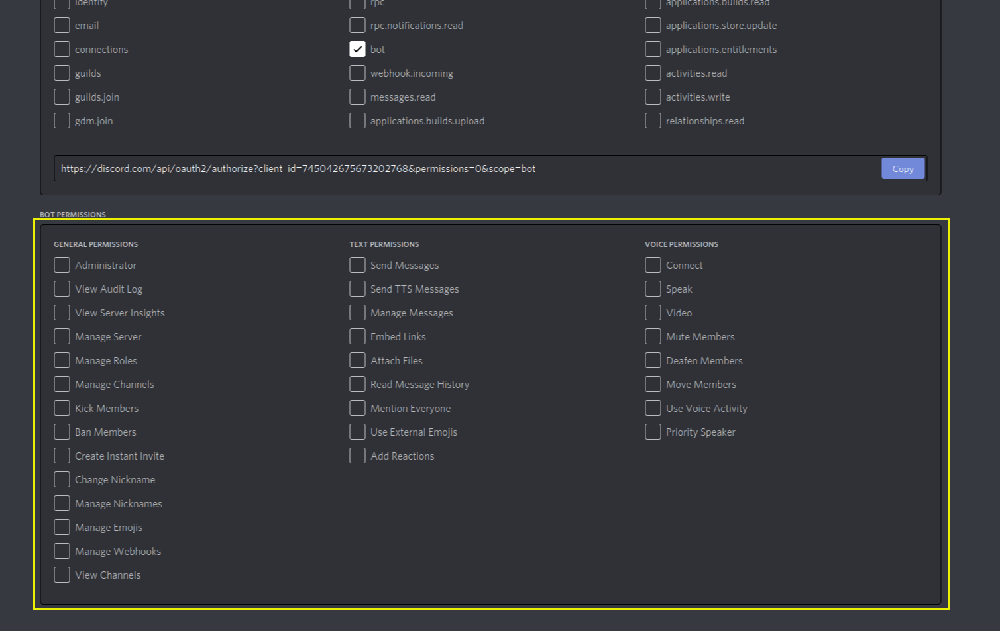
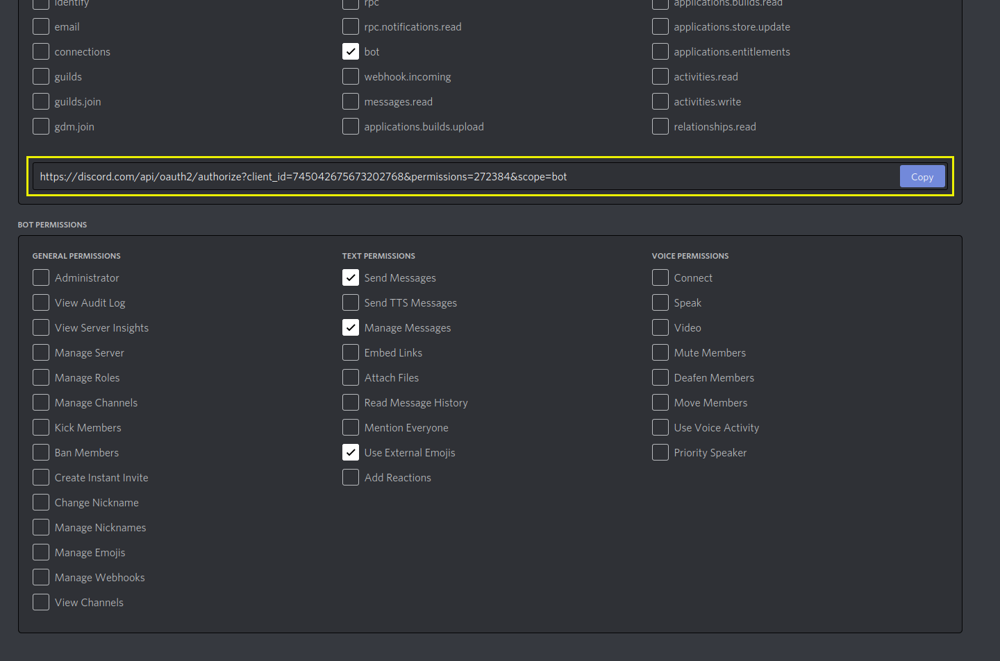
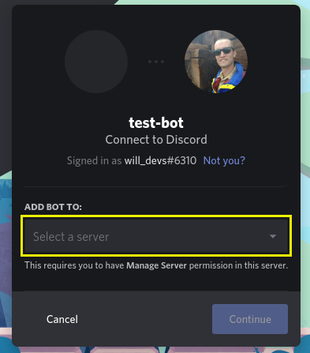
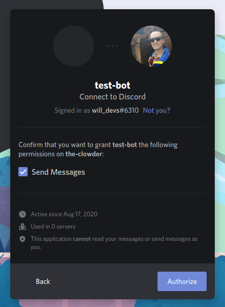

This is a quick walkthrough of how to add a bot to a Discord server.

- Visit `discord.com/developers/applications` and log in with your Discord account.
- After logging in, click "New Application" at the top right:
  
- Enter the name of your application, I'll use the name `test-bot` here:
  
- Click on the "Bot" option in the left sidebar to open the Bot creation page:
  
- Click on the "Add Bot" option:
  
- Next, click on the "OAuth2" option in the left sidebar:
  
- Select the bot scope at the bottom of the page:
  
- Select the permissions you'd like this bot to have:
  
- Copy the generated OAuth url and paste it into your browser:
  
- This brings you to an OAuth page that asks you to select which server to attach your bot to&mdash;note that **in order to attach the bot to a server, you must have the "Manage Server" permissions in the server**
  
- After you've selected the server you wish you use, click "Continue"
- This dialogue will give you the opportunity to restrict the permissions that will be granted to the bot on this server. This gives you another chance to modify the specific permissions you'd like the bot to have on this server:
  
- Once you've selected the permissions you'd like to grant, click "Authorize."
- You will also have to pass a reCAPTCHA at this point.
- After all of this, the Discord bot should join your server!
